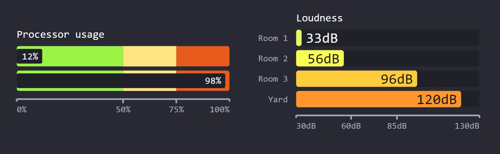

# WIP components for [influxdata/giraffe](https://github.com/influxdata/giraffe/)

## To run project:
 1. have [node](https://nodejs.org/) and [yarn](https://yarnpkg.com/) installed
 1. call `yarn dev` (starts server)
 1. open [`localhost:3000`](http://localhost:3000) or start __vscode debug__

# Bullet graph - Mini gauge _(progress-bar)_

## Current state:

## TODO:
 - create gireffe tooltip?

### BUG: 
